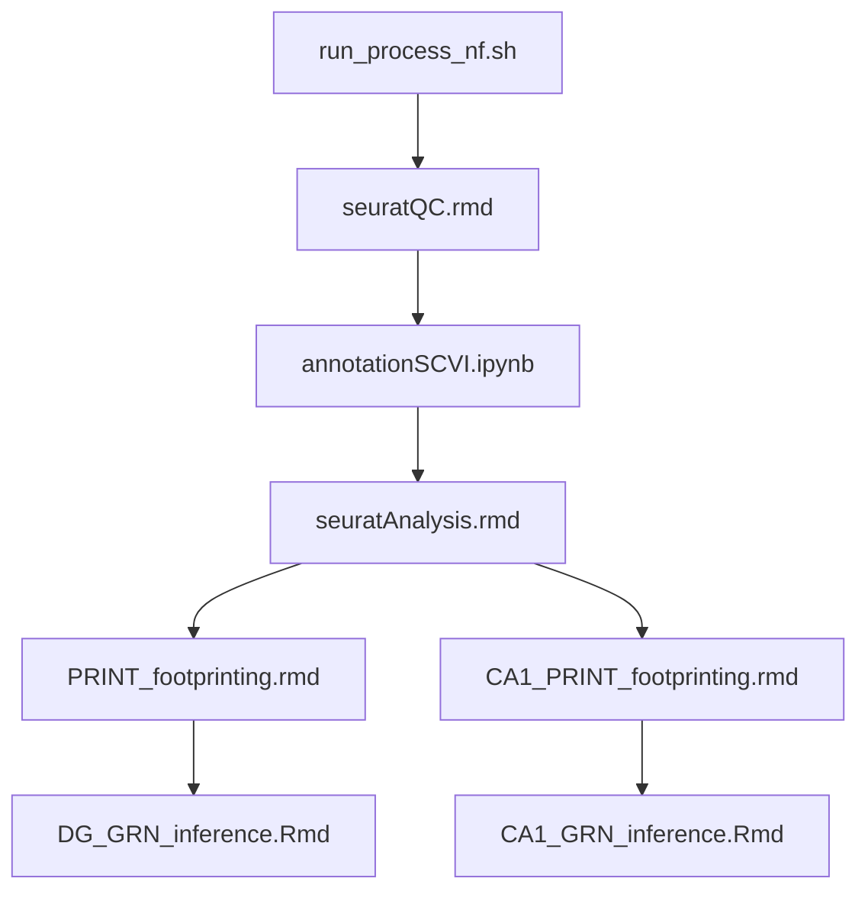

# lxr

This repository contains the code used to produce the manuscript 'LXR Agonism Supresses the Age-Related Emergence of a Microglial Subpopulation and Rescues Spatial Memory Deficits in Aged Mice'. The code is organized into several scripts and notebooks that should be run in a specific order to reproduce the results presented in the paper. 

## Folder Structure

- `scripts/`: Contains scripts for data analysis.
- `data/`: Contains raw and processed data files. 

## File Run Order

The multiome analysis files were run in the following order:

1. `scripts/multiome/bash/run_process_nf.sh` - Process multiome data from raw reads to RNA and ATAC count matrices for each sample (using cellranger-arc), corrected for ambient RNA contamination with cellbender.
2. `scripts/multiome/R/seurat_QC.rmd` - Basic QC and consensus clustering of scMultiome Data
3. `scripts/multiome/python/annotationSCVI.ipynb` - Annotation of scMultiome Data using Allen Brain atlas reference dataset
4. `scripts/multiome/R/seurat_analysis.rmd` - In depth analysis of different celltypes
5. `scripts/multiome/R/PRINT_footprinting.rmd` - Footprinting analysis of DG granule cells, required for GRN inference
6. `scripts/multiome/R/CA1_PRINT_footprinting.rmd` - Footprinting analysis of CA1 pyramidal neurons, required for GRN inference
7. `scripts/multiome/R/CA1_GRN_inference.Rmd` - GRN inference of CA1 pyramidal neurons
8. `scripts/multiome/R/DG_GRN_inference.Rmd` - GRN inference of DG granule cells

Statistical analysis of imaging results is in file `scripts/imaging/imaging_analysis.rmd`.

Statistical analysis of behavioural test results is in file `scripts/behaviour/behaviour_analysis.rmd`.

For any questions or issues, please contact Andrew C Graham.
